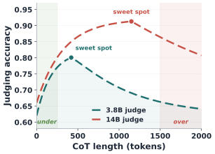
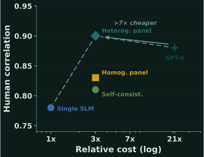
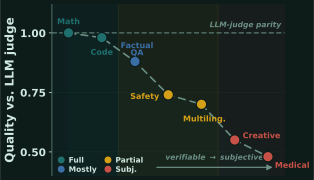
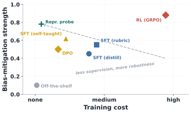
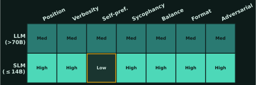
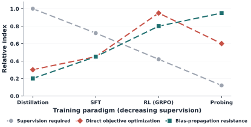
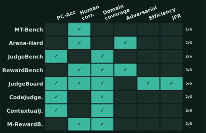

<p align="center">
  
</p>

<div align="center">

<!-- Badges -->
<a href="https://anishh15.github.io/Awesome-SLM-as-a-Judge/paper.pdf"></a>
<a href="https://anishh15.github.io/Awesome-SLM-as-a-Judge/"></a>
<a href="https://github.com/anishh15/Awesome-SLM-as-a-Judge"></a>
<a href="LICENSE"></a>

*A curated collection of papers, benchmarks, datasets, and resources for the **SLM-as-a-Judge** paradigm.*

**📑 60+ Papers &bull; 🧠 15+ Judge Systems &bull; 🏗️ 5 Model Families &bull; 📊 10 Benchmarks &bull; ≤14B Parameters**

[**🌐 Website**](https://anishh15.github.io/Awesome-SLM-as-a-Judge/) | [**📖 Read Paper**](https://anishh15.github.io/Awesome-SLM-as-a-Judge/paper.pdf) | [**⭐ Star This Repo**](https://github.com/anishh15/Awesome-SLM-as-a-Judge)

</div>

---

## 📢 Latest News

| Date | Update |
|------|--------|
| **Jun 2026** | Project website launched: [anishh15.github.io/Awesome-SLM-as-a-Judge](https://anishh15.github.io/Awesome-SLM-as-a-Judge/) |
| **Jun 2026** | Survey paper released: *Small Language Models as Judges: A Survey* |
| **May 2026** | Repository launched as companion to our EMNLP 2026 survey submission |

---

## 🔥 Latest Papers

|  Title  |   Venue  |   Date   |   Code   |
|:--------|:--------:|:--------:|:--------:|
| [**Improving Code Generation via Small Language Model-as-a-Judge**](https://arxiv.org/abs/2602.11911) | ArXiv | 2026-02 | - |
| [**The Persona Paradox: Medical Personas as Behavioral Priors in Clinical Language Models**](https://arxiv.org/abs/2601.05376) | ArXiv | 2026-01 |  - |
| [**Rethinking LLM-as-a-Judge: Representation-as-a-Judge with SLMs via Semantic Capacity Asymmetry**](https://arxiv.org/abs/2601.22588) | ArXiv | 2026-01 | - |
| [**Efficient LLM Safety Evaluation through Multi-Agent Debate**](https://arxiv.org/abs/2511.06396) | ArXiv | 2025-11 | - |
| [**StepWiseR: Stepwise Generative Judges for Wiser Reasoning**](https://arxiv.org/abs/2508.19229) | ArXiv | 2025-08 | - |
| [**OptimalThinkingBench: Evaluating Over and Underthinking in LLMs**](https://arxiv.org/abs/2508.13141) | ArXiv | 2025-08 | - |
| [**One Token to Fool LLM-as-a-Judge**](https://arxiv.org/abs/2507.08794) | ArXiv | 2025-07 | - |
|  <br> [**CompassJudger-2: Towards Generalist Judge Model via Verifiable Rewards**](https://arxiv.org/abs/2507.09104) | ArXiv | 2025-07 | [Github](https://github.com/open-compass/CompassJudger) |
| [**Multi-Agent Debate for LLM Judges with Adaptive Stability Detection**](https://arxiv.org/abs/2510.12697) | NeurIPS | 2026 | - |
| [**"Talk Isn't Always Cheap": Understanding Failure Modes in Multi-Agent Debate**](https://arxiv.org/abs/2509.05396) | ArXiv | 2025-09 | - |

---

## 🌳 Table of Contents

- [Latest News](#-latest-news)
- [Latest Papers](#-latest-papers)
- [About This Repository](#-about-this-repository)
- [Overview](#-overview)
- [Key Insights from the Survey](#-key-insights-from-the-survey)
- [Paper List](#-paper-list)
  - [1. Foundational LLM-as-a-Judge Work](#1-foundational-llm-as-a-judge-work)
  - [2. Specialized & Fine-Tuned Judge Models](#2-specialized--fine-tuned-judge-models)
  - [3. Token Budget, Reasoning Efficiency & Overthinking](#3-token-budget-reasoning-efficiency--overthinking)
  - [4. Ensemble & Panel-Based Methods](#4-ensemble--panel-based-methods)
  - [5. Multi-Agent Debate & Deliberation](#5-multi-agent-debate--deliberation)
  - [6. Persona Effects & Prompt Sensitivity](#6-persona-effects--prompt-sensitivity)
  - [7. Judge Biases, Preference Leakage & Uncertainty](#7-judge-biases-preference-leakage--uncertainty)
  - [8. Adversarial Robustness](#8-adversarial-robustness)
  - [9. Multilingual Evaluation](#9-multilingual-evaluation)
  - [10. Self-Evolving & Self-Improving Judges](#10-self-evolving--self-improving-judges)
  - [11. Alignment, RLHF & Training Methods](#11-alignment-rlhf--training-methods)
  - [12. Reasoning & Chain-of-Thought](#12-reasoning--chain-of-thought)
  - [13. Model Papers](#13-model-papers)
- [Benchmarks & Datasets](#-benchmarks--datasets)
- [Related Surveys](#-related-surveys)
- [Citation](#-citation)
- [Contributing](#-contributing)

---

## 🌟 About This Repository

This repository accompanies our survey paper **"Small Language Models as Judges: A Survey"**, which provides the first comprehensive review of the emerging paradigm where **Small Language Models (SLMs)**, operationally defined as models with **≤14B parameters** that can run on a single consumer GPU, serve as automated evaluators.

We organize the rapidly expanding literature around a structured taxonomy spanning five key dimensions:

1. **Background & Motivation**: Why SLM judges, formal definitions, and evaluation formalism
2. **Individual SLM Judging**: Specialized judges, token budgets, capability thresholds, overthinking, biases, and thinking modes
3. **Multi-Agent Strategies**: Ensembles, debate, output optimization, and persona robustness
4. **Benchmarks & Metrics**: Meta-evaluation infrastructure, adversarial robustness
5. **Challenges & Future Directions**: Open research problems along the verifiability gradient

We will continuously update this repository with the latest papers and resources. If you find this helpful, please ⭐ star the repo!

> 📬 **Missing a paper?** Feel free to [open an issue](https://github.com/anishh15/Awesome-SLM-as-a-Judge/issues) or submit a pull request.

---

## 📊 Overview

<p align="center">
  
</p>

> *Figure: Taxonomy of the SLM-as-a-Judge survey, organized around five key dimensions: background and motivation, individual SLM judging, multi-agent strategies, benchmarks and metrics, and challenges and future directions.*

---

## 🔬 Key Insights from the Survey

Our survey identifies five convergent insights with multi-paper evidence:

<p align="center">
  
  
</p>

> *Left: Scale vs. capability, where fine-tuned 3-8B judges match proprietary models on standard benchmarks. Right: Reasoning tokens help only when they carry new discriminative signal.*

<p align="center">
  
  
</p>

> *Left: Heterogeneous SLM juries decorrelate errors more effectively than scaling a single judge. Right: The verifiability gradient, where SLM judges approach parity in high-verifiability domains but degrade for subjective tasks.*

<p align="center">
  
</p>

> *The cost-quality frontier: SLM judges occupy a practical sweet spot for most automated evaluation.*

---

## 📑 Paper List

### 1. Foundational LLM-as-a-Judge Work

|  Title  |   Venue  |   Year   |   Links   |
|:--------|:--------:|:--------:|:---------:|
| [**Judging LLM-as-a-Judge with MT-Bench and Chatbot Arena**](https://arxiv.org/abs/2306.05685) | NeurIPS | 2023 | [[pdf]](https://arxiv.org/abs/2306.05685) |
|  <br> [**JudgeLM: Fine-tuned Large Language Models are Scalable Judges**](https://arxiv.org/abs/2310.17631) | ICLR | 2025 | [[pdf]](https://arxiv.org/abs/2310.17631) [[code]](https://github.com/baaivision/JudgeLM) |
|  <br> [**Prometheus: Inducing Fine-grained Evaluation Capability in Language Models**](https://arxiv.org/abs/2310.08491) | ICLR | 2024 | [[pdf]](https://arxiv.org/abs/2310.08491) [[code]](https://github.com/prometheus-eval/prometheus) |
| [**Prometheus 2: An Open Source Language Model Specialized in Evaluating Other Language Models**](https://arxiv.org/abs/2405.01535) | EMNLP | 2024 | [[pdf]](https://arxiv.org/abs/2405.01535) |
|  <br> [**PandaLM: An Automatic Evaluation Benchmark for LLM Instruction Tuning**](https://arxiv.org/abs/2306.05087) | ICLR | 2024 | [[pdf]](https://arxiv.org/abs/2306.05087) [[code]](https://github.com/WeOpenML/PandaLM) |
| [**Humans or LLMs as the Judge? A Study on Judgement Biases**](https://arxiv.org/abs/2402.10669) | EMNLP | 2024 | [[pdf]](https://arxiv.org/abs/2402.10669) |
| [**Limitations of the LLM-as-a-Judge Approach for Evaluating LLM Outputs in Expert Knowledge Tasks**](https://arxiv.org/abs/2410.20266) | IUI | 2025 | [[pdf]](https://arxiv.org/abs/2410.20266) |
| [**Who Validates the Validators? Aligning LLM-Assisted Evaluation with Human Preferences**](https://arxiv.org/abs/2404.12272) | UIST | 2024 | [[pdf]](https://arxiv.org/abs/2404.12272) |
| [**Potential and Perils of Large Language Models as Judges of Unstructured Textual Data**](https://arxiv.org/abs/2501.08167) | ArXiv | 2025 | [[pdf]](https://arxiv.org/abs/2501.08167) |

---

### 2. Specialized & Fine-Tuned Judge Models

<p align="center">
  
</p>

> *Figure: Comparison of training paradigms for SLM judge systems.*

|  Title  |   Venue  |   Year   |   Links   |
|:--------|:--------:|:--------:|:---------:|
| [**GLIDER: Grading LLM Interactions and Decisions using Explainable Ranking**](https://arxiv.org/abs/2412.14140) | ArXiv | 2024 | [[pdf]](https://arxiv.org/abs/2412.14140) [[model]](https://huggingface.co/PatronusAI/glider) |
| [**J1: Incentivizing Thinking in LLM-as-a-Judge via Reinforcement Learning**](https://arxiv.org/abs/2505.10320) | ArXiv | 2025 | [[pdf]](https://arxiv.org/abs/2505.10320) |
|  <br> [**JudgeLRM: Large Reasoning Models as a Judge**](https://arxiv.org/abs/2504.00050) | ArXiv | 2025 | [[pdf]](https://arxiv.org/abs/2504.00050) [[code]](https://github.com/NuoJohnChen/JudgeLRM) |
|  <br> [**CompassJudger-2: Towards Generalist Judge Model via Verifiable Rewards**](https://arxiv.org/abs/2507.09104) | ArXiv | 2025 | [[pdf]](https://arxiv.org/abs/2507.09104) [[code]](https://github.com/open-compass/CompassJudger) |
| [**J4R: Learning to Judge with Equivalent Initial State Group Relative Policy Optimization**](https://arxiv.org/abs/2505.13346) | ArXiv | 2025 | [[pdf]](https://arxiv.org/abs/2505.13346) |
| [**FLAMe: Foundational Large Autorater Models**](https://arxiv.org/abs/2407.10817) | EMNLP | 2024 | [[pdf]](https://arxiv.org/abs/2407.10817) |
| [**Rethinking LLM-as-a-Judge: Representation-as-a-Judge with SLMs via Semantic Capacity Asymmetry**](https://arxiv.org/abs/2601.22588) | ArXiv | 2026 | [[pdf]](https://arxiv.org/abs/2601.22588) |
| [**Explicit Reasoning Makes Better Judges: A Systematic Study on Accuracy, Efficiency, and Robustness**](https://arxiv.org/abs/2509.13332) | ArXiv | 2025 | [[pdf]](https://arxiv.org/abs/2509.13332) |
| [**Shepherd: A Critic for Language Model Generation**](https://arxiv.org/abs/2308.04592) | ArXiv | 2023 | [[pdf]](https://arxiv.org/abs/2308.04592) |
| [**Auto-J: Generative Judge for Evaluating Alignment**](https://arxiv.org/abs/2310.05470) | ICLR | 2024 | [[pdf]](https://arxiv.org/abs/2310.05470) |
| [**Atla Selene Mini: A General Purpose Evaluation Model**](https://arxiv.org/abs/2501.17195) | ArXiv | 2025 | [[pdf]](https://arxiv.org/abs/2501.17195) [[model]](https://huggingface.co/AtlaAI/Selene-1-Mini-Llama-3.1-8B) |
| [**StepWiseR: Stepwise Generative Judges for Wiser Reasoning**](https://arxiv.org/abs/2508.19229) | ArXiv | 2025 | [[pdf]](https://arxiv.org/abs/2508.19229) |
| [**Improving Code Generation via Small Language Model-as-a-Judge**](https://arxiv.org/abs/2602.11911) | ArXiv | 2026 | [[pdf]](https://arxiv.org/abs/2602.11911) |
| [**Igniting Creative Writing in Small Language Models: LLM-as-a-Judge versus Multi-Agent Refined Rewards**](https://arxiv.org/abs/2508.21476) | EMNLP | 2025 | [[pdf]](https://arxiv.org/abs/2508.21476) [[code]](https://github.com/weixiaolong94-hub/Igniting-Creative-Writing-in-Small-Language-Models) |
|  <br> [**GenPRM: Scaling Test-Time Compute of Process Reward Models via Generative Reasoning**](https://arxiv.org/abs/2504.00891) | AAAI | 2026 | [[pdf]](https://arxiv.org/abs/2504.00891) [[code]](https://github.com/RyanLiu112/GenPRM) |
| [**FLEUR: An Explainable Reference-Free Evaluation Metric for Image Captioning**](https://arxiv.org/abs/2406.06004) | ACL | 2024 | [[pdf]](https://arxiv.org/abs/2406.06004) |
| [**Trust or Escalate: LLM Judges with Provable Guarantees for Human Agreement**](https://arxiv.org/abs/2407.18370) | ICLR | 2025 | [[pdf]](https://arxiv.org/abs/2407.18370) |

---

### 3. Token Budget, Reasoning Efficiency & Overthinking

|  Title  |   Venue  |   Year   |   Links   |
|:--------|:--------:|:--------:|:---------:|
| [**Token-Budget-Aware LLM Reasoning**](https://arxiv.org/abs/2412.18547) | ACL Findings | 2025 | [[pdf]](https://arxiv.org/abs/2412.18547) |
| [**Reasoning in Token Economies: Budget-Aware Evaluation of LLM Reasoning Strategies**](https://arxiv.org/abs/2406.06461) | EMNLP | 2024 | [[pdf]](https://arxiv.org/abs/2406.06461) |
| [**Stop Overthinking: A Survey on Efficient Reasoning for Large Language Models**](https://arxiv.org/abs/2503.16419) | ArXiv | 2025 | [[pdf]](https://arxiv.org/abs/2503.16419) |
| [**Do LLMs Overthink Basic Math Reasoning? Benchmarking Accuracy-Efficiency Tradeoff**](https://arxiv.org/abs/2507.04023) | ArXiv | 2025 | [[pdf]](https://arxiv.org/abs/2507.04023) |
| [**Reasoning Models Can Be Effective Without Thinking**](https://arxiv.org/abs/2504.09858) | ArXiv | 2025 | [[pdf]](https://arxiv.org/abs/2504.09858) |
| [**The Illusion of Thinking: Understanding Strengths and Limitations of Reasoning Models**](https://arxiv.org/abs/2506.06941) | NeurIPS | 2026 | [[pdf]](https://arxiv.org/abs/2506.06941) |
| [**Does Thinking More Always Help? Mirage of Test-Time Scaling in Reasoning Models**](https://arxiv.org/abs/2506.04210) | NeurIPS | 2026 | [[pdf]](https://arxiv.org/abs/2506.04210) |
| [**OptimalThinkingBench: Evaluating Over and Underthinking in LLMs**](https://arxiv.org/abs/2508.13141) | ArXiv | 2025 | [[pdf]](https://arxiv.org/abs/2508.13141) |

---

### 4. Ensemble & Panel-Based Methods

<p align="center">
  
</p>

> *Figure: Taxonomy of multi-agent evaluation strategies: ensembles, juries, and debate.*

|  Title  |   Venue  |   Year   |   Links   |
|:--------|:--------:|:--------:|:---------:|
| [**Replacing Judges with Juries: Evaluating LLM Generations with a Panel of Diverse Models (PoLL)**](https://arxiv.org/abs/2404.18796) | ArXiv | 2024 | [[pdf]](https://arxiv.org/abs/2404.18796) |
| [**Self-Consistency Improves Chain of Thought Reasoning in Language Models**](https://arxiv.org/abs/2203.11171) | ICLR | 2023 | [[pdf]](https://arxiv.org/abs/2203.11171) |
| [**COSMosFL: Ensemble of Small Language Models for Fault Localisation**](https://arxiv.org/abs/2502.02908) | LLM4Code | 2025 | [[pdf]](https://arxiv.org/abs/2502.02908) |
| [**Crowd Comparative Reasoning: Unlocking Comprehensive Evaluations for LLM-as-a-Judge**](https://arxiv.org/abs/2502.12501) | ACL | 2025 | [[pdf]](https://arxiv.org/abs/2502.12501) [[code]](https://github.com/Don-Joey/CCE) |
| [**Causal Judge Evaluation: Calibrated Surrogate Metrics for LLM Systems**](https://arxiv.org/abs/2512.11150) | ArXiv | 2025 | [[pdf]](https://arxiv.org/abs/2512.11150) |
| [**TRUSTJUDGE: Inconsistencies of LLM-as-a-Judge and How to Alleviate Them**](https://arxiv.org/abs/2509.21117) | ArXiv | 2025 | [[pdf]](https://arxiv.org/abs/2509.21117) |

---

### 5. Multi-Agent Debate & Deliberation

<p align="center">
  
</p>

> *Figure: Failure modes in multi-agent debate systems (MAST taxonomy).*

|  Title  |   Venue  |   Year   |   Links   |
|:--------|:--------:|:--------:|:---------:|
| [**Improving Factuality and Reasoning in Language Models through Multiagent Debate**](https://arxiv.org/abs/2305.14325) | ICML | 2024 | [[pdf]](https://arxiv.org/abs/2305.14325) |
| [**Encouraging Divergent Thinking in Large Language Models through Multi-Agent Debate**](https://arxiv.org/abs/2305.19118) | EMNLP | 2024 | [[pdf]](https://arxiv.org/abs/2305.19118) |
| [**DEBATE, TRAIN, EVOLVE: Self-Evolution of Language Model Reasoning**](https://arxiv.org/abs/2505.15734) | EMNLP | 2025 | [[pdf]](https://arxiv.org/abs/2505.15734) |
| [**Multi-Agent Debate for LLM Judges with Adaptive Stability Detection**](https://arxiv.org/abs/2510.12697) | NeurIPS | 2026 | [[pdf]](https://arxiv.org/abs/2510.12697) |
| [**Efficient LLM Safety Evaluation through Multi-Agent Debate**](https://arxiv.org/abs/2511.06396) | ArXiv | 2025 | [[pdf]](https://arxiv.org/abs/2511.06396) |
| [**"Talk Isn't Always Cheap": Understanding Failure Modes in Multi-Agent Debate**](https://arxiv.org/abs/2509.05396) | ArXiv | 2025 | [[pdf]](https://arxiv.org/abs/2509.05396) |
| [**Stop Overvaluing Multi-Agent Debate: We Must Rethink Evaluation and Embrace Model Heterogeneity**](https://arxiv.org/abs/2502.08788) | ArXiv | 2025 | [[pdf]](https://arxiv.org/abs/2502.08788) |
| [**Why Do Multi-Agent LLM Systems Fail?**](https://arxiv.org/abs/2503.13657) | NeurIPS | 2026 | [[pdf]](https://arxiv.org/abs/2503.13657) [[code]](https://github.com/multi-agent-systems-failure-taxonomy/MAST/) |

---

### 6. Persona Effects & Prompt Sensitivity

|  Title  |   Venue  |   Year   |   Links   |
|:--------|:--------:|:--------:|:---------:|
| [**Two Tales of Persona in LLMs: A Survey of Role-Playing and Personalization**](https://arxiv.org/abs/2406.01171) | EMNLP Findings | 2024 | [[pdf]](https://arxiv.org/abs/2406.01171) |
| [**In-Context Impersonation Reveals Large Language Models' Strengths and Biases**](https://arxiv.org/abs/2305.14930) | NeurIPS | 2023 | [[pdf]](https://arxiv.org/abs/2305.14930) |
| [**The Persona Paradox: Medical Personas as Behavioral Priors in Clinical Language Models**](https://arxiv.org/abs/2601.05376) | ArXiv | 2026 | [[pdf]](https://arxiv.org/abs/2601.05376) |
|  <br> [**SynthesizeMe! Inducing Persona-Guided Prompts for Personalized Reward Models**](https://arxiv.org/abs/2506.05598) | ACL | 2025 | [[pdf]](https://arxiv.org/abs/2506.05598) [[code]](https://github.com/SALT-NLP/SynthesizeMe) |

---

### 7. Judge Biases, Preference Leakage & Uncertainty

<p align="center">
  
</p>

> *Figure: Heatmap of structural biases across judge models and evaluation settings.*

|  Title  |   Venue  |   Year   |   Links   |
|:--------|:--------:|:--------:|:---------:|
| [**Preference Leakage: A Contamination Problem in LLM-as-a-Judge**](https://arxiv.org/abs/2502.01534) | ArXiv | 2025 | [[pdf]](https://arxiv.org/abs/2502.01534) |
| [**Justice or Prejudice? Quantifying Biases in LLM-as-a-Judge**](https://arxiv.org/abs/2410.02736) | ICLR | 2025 | [[pdf]](https://arxiv.org/abs/2410.02736) [[code]](https://github.com/Y0oMu/LLM-Judge-Bias-Dataset) |
| [**Analyzing Uncertainty of LLM-as-a-Judge: Interval Evaluations with Conformal Prediction**](https://arxiv.org/abs/2509.18658) | EMNLP | 2025 | [[pdf]](https://arxiv.org/abs/2509.18658) [[code]](https://github.com/BruceSheng1202/Analyzing_Uncertainty_of_LLM-as-a-Judge) |

---

### 8. Adversarial Robustness

<p align="center">
  
</p>

> *Figure: Defense strategies against adversarial attacks on LLM judges.*

|  Title  |   Venue  |   Year   |   Links   |
|:--------|:--------:|:--------:|:---------:|
|  <br> [**Cheating Automatic LLM Benchmarks: Null Models Achieve High Win Rates**](https://arxiv.org/abs/2410.07137) | ICLR (Oral) | 2025 | [[pdf]](https://arxiv.org/abs/2410.07137) [[code]](https://github.com/sail-sg/Cheating-LLM-Benchmarks) |
| [**One Token to Fool LLM-as-a-Judge**](https://arxiv.org/abs/2507.08794) | ArXiv | 2025 | [[pdf]](https://arxiv.org/abs/2507.08794) |

---

### 9. Multilingual Evaluation

|  Title  |   Venue  |   Year   |   Links   |
|:--------|:--------:|:--------:|:---------:|
| [**M-Prometheus: A Suite of Open Multilingual LLM Judges**](https://arxiv.org/abs/2504.04953) | ArXiv | 2025 | [[pdf]](https://arxiv.org/abs/2504.04953) |

---

### 10. Self-Evolving & Self-Improving Judges

|  Title  |   Venue  |   Year   |   Links   |
|:--------|:--------:|:--------:|:---------:|
| [**Self-Taught Evaluators**](https://arxiv.org/abs/2408.02666) | ArXiv | 2024 | [[pdf]](https://arxiv.org/abs/2408.02666) |
| [**DEBATE, TRAIN, EVOLVE: Self-Evolution of Language Model Reasoning**](https://arxiv.org/abs/2505.15734) | EMNLP | 2025 | [[pdf]](https://arxiv.org/abs/2505.15734) |
| [**Weak-to-Strong Generalization: Eliciting Strong Capabilities With Weak Supervision**](https://arxiv.org/abs/2312.09390) | ArXiv | 2023 | [[pdf]](https://arxiv.org/abs/2312.09390) |

---

### 11. Alignment, RLHF & Training Methods

<p align="center">
  
</p>

> *Figure: Supervision paradigms for training SLM judges.*

|  Title  |   Venue  |   Year   |   Links   |
|:--------|:--------:|:--------:|:---------:|
| [**Training Language Models to Follow Instructions with Human Feedback**](https://arxiv.org/abs/2203.02155) | NeurIPS | 2022 | [[pdf]](https://arxiv.org/abs/2203.02155) |
| [**Constitutional AI: Harmlessness from AI Feedback**](https://arxiv.org/abs/2212.08073) | ArXiv | 2022 | [[pdf]](https://arxiv.org/abs/2212.08073) |
| [**Direct Preference Optimization: Your Language Model is Secretly a Reward Model**](https://arxiv.org/abs/2305.18290) | NeurIPS | 2023 | [[pdf]](https://arxiv.org/abs/2305.18290) |
| [**Let's Verify Step by Step**](https://arxiv.org/abs/2305.20050) | ICLR | 2024 | [[pdf]](https://arxiv.org/abs/2305.20050) |

---

### 12. Reasoning & Chain-of-Thought

|  Title  |   Venue  |   Year   |   Links   |
|:--------|:--------:|:--------:|:---------:|
| [**Chain-of-Thought Prompting Elicits Reasoning in Large Language Models**](https://arxiv.org/abs/2201.11903) | NeurIPS | 2022 | [[pdf]](https://arxiv.org/abs/2201.11903) |
|  <br> [**DeepSeek-R1: Incentivizing Reasoning in LLMs through Reinforcement Learning**](https://arxiv.org/abs/2501.12948) | Nature | 2025 | [[pdf]](https://arxiv.org/abs/2501.12948) [[code]](https://github.com/deepseek-ai/DeepSeek-R1) |

---

### 13. Model Papers

<p align="center">
  
</p>

> *Figure: Capability heatmap across SLM model families.*

|  Title  |   Venue  |   Year   |   Links   |
|:--------|:--------:|:--------:|:---------:|
| [**GPT-4 Technical Report**](https://arxiv.org/abs/2303.08774) | ArXiv | 2023 | [[pdf]](https://arxiv.org/abs/2303.08774) |
| [**Qwen2.5 Technical Report**](https://arxiv.org/abs/2412.15115) | ArXiv | 2025 | [[pdf]](https://arxiv.org/abs/2412.15115) |
| [**Qwen3 Technical Report**](https://arxiv.org/abs/2505.09388) | ArXiv | 2025 | [[pdf]](https://arxiv.org/abs/2505.09388) |
| [**The Llama 3 Herd of Models**](https://arxiv.org/abs/2407.21783) | ArXiv | 2024 | [[pdf]](https://arxiv.org/abs/2407.21783) |
| [**Phi-4 Technical Report**](https://arxiv.org/abs/2412.08905) | ArXiv | 2024 | [[pdf]](https://arxiv.org/abs/2412.08905) |
| [**Phi-4-Mini Technical Report**](https://arxiv.org/abs/2503.01743) | ArXiv | 2025 | [[pdf]](https://arxiv.org/abs/2503.01743) |
| [**Phi-4-Reasoning Technical Report**](https://arxiv.org/abs/2504.21318) | ArXiv | 2025 | [[pdf]](https://arxiv.org/abs/2504.21318) |
| [**Gemma: Open Models Based on Gemini Research and Technology**](https://arxiv.org/abs/2403.08295) | ArXiv | 2024 | [[pdf]](https://arxiv.org/abs/2403.08295) |
| [**Gemma 2: Improving Open Language Models at a Practical Size**](https://arxiv.org/abs/2408.00118) | ArXiv | 2024 | [[pdf]](https://arxiv.org/abs/2408.00118) |
| [**Gemma 4, Phi-4, and Qwen3: Accuracy-Efficiency Tradeoffs in Dense and MoE Reasoning Language Models**](https://arxiv.org/abs/2604.07035) | ArXiv | 2026 | [[pdf]](https://arxiv.org/abs/2604.07035) |

---

## 📦 Benchmarks & Datasets

### Meta-Evaluation Benchmarks

<p align="center">
  
</p>

> *Figure: Coverage of meta-evaluation benchmarks across evaluation dimensions.*

| Benchmark | Description | Paper |
|-----------|-------------|-------|
| **MT-Bench** | 80 multi-turn questions, 8 categories, pairwise + single-scoring | [Zheng et al., 2023](https://arxiv.org/abs/2306.05685) |
| **JudgeBench** | 350 challenging response pairs across knowledge, reasoning, math, coding | [Tan et al., 2025](https://arxiv.org/abs/2410.12784) |
| **RewardBench** | Evaluation of reward models across chat, safety, reasoning | [Lambert et al., 2025](https://arxiv.org/abs/2403.13787) |
| **JudgeBoard** | Benchmarking small language models for reasoning evaluation | [Bi et al., 2026](https://arxiv.org/abs/2511.15958) |
| **CodeJudgeBench** | Benchmarking LLM-as-a-Judge for coding tasks | [Jiang et al., 2025](https://arxiv.org/abs/2507.10535) |
| **ContextualJudgeBench** | Evaluating judges in contextual settings | [Xu et al., 2025](https://arxiv.org/abs/2503.15620) |

### Reasoning & Math Benchmarks (Used as Evaluation Substrates)

| Benchmark | Description | Paper |
|-----------|-------------|-------|
| **GSM8K** | 8.5K grade-school math word problems | [Cobbe et al., 2021](https://arxiv.org/abs/2110.14168) |
| **MATH** | 12.5K competition-level math problems across 7 topics | [Hendrycks et al., 2021](https://arxiv.org/abs/2103.03874) |
| **MMLU** | Massive Multitask Language Understanding benchmark | [Hendrycks et al., 2020](https://arxiv.org/abs/2009.03300) |

### Code & Safety Benchmarks

| Benchmark | Description | Paper |
|-----------|-------------|-------|
| **SWE-bench** | Can language models resolve real-world GitHub issues? | [Jimenez et al., 2024](https://arxiv.org/abs/2310.06770) |
| **LiveCodeBench** | Holistic and contamination-free evaluation for code | [Jain et al., 2025](https://arxiv.org/abs/2403.07974) |
| **DecodingTrust** | Comprehensive assessment of trustworthiness in GPT models | [Wang et al., 2023](https://arxiv.org/abs/2306.11698) |
| **TruthfulQA** | Measuring how models mimic human falsehoods | [Lin et al., 2022](https://arxiv.org/abs/2109.07958) |

### Foundational NLP Evaluation Metrics

| Metric | Description | Paper |
|--------|-------------|-------|
| **BLEU** | Automatic evaluation of machine translation | [Papineni et al., 2002](https://aclanthology.org/P02-1040/) |
| **BERTScore** | Evaluating text generation with BERT embeddings | [Zhang et al., 2019](https://arxiv.org/abs/1904.09675) |
| **COMET** | Neural framework for MT evaluation | [Rei et al., 2020](https://aclanthology.org/2020.emnlp-main.213/) |

---

## 📚 Related Surveys

| Survey | Focus | Year | Links |
|--------|-------|------|-------|
| [**A Survey on LLM-as-a-Judge**](https://arxiv.org/abs/2411.15594) | Formal definitions, reliability, bias in LLM-based evaluation | 2024 | [[pdf]](https://arxiv.org/abs/2411.15594) |
| [**From Generation to Judgment: Opportunities and Challenges of LLM-as-a-Judge**](https://arxiv.org/abs/2411.16594) | Transition from generation to judgment | 2024 | [[pdf]](https://arxiv.org/abs/2411.16594) |
|  <br> [**LLMs-as-Judges: A Comprehensive Survey on LLM-based Evaluation Methods**](https://arxiv.org/abs/2412.05579) | Comprehensive review of LLM evaluation methods | 2024 | [[pdf]](https://arxiv.org/abs/2412.05579) [[repo]](https://github.com/CSHaitao/Awesome-LLMs-as-Judges) |
|  <br> [**Efficient Large Language Models: A Survey**](https://arxiv.org/abs/2312.03863) | Efficiency techniques for large models | 2023 | [[pdf]](https://arxiv.org/abs/2312.03863) [[repo]](https://github.com/AIoT-MLSys-Lab/Efficient-LLMs-Survey) |
| [**Small Language Models: Survey, Measurements, and Insights**](https://arxiv.org/abs/2409.15790) | SLM architectures and deployment | 2024 | [[pdf]](https://arxiv.org/abs/2409.15790) |
| [**Stop Overthinking: A Survey on Efficient Reasoning for LLMs**](https://arxiv.org/abs/2503.16419) | Efficient reasoning and overthinking phenomenon | 2025 | [[pdf]](https://arxiv.org/abs/2503.16419) |

---

## 📖 Citation

If you find this survey and repository useful for your research, please cite our paper:

```bibtex
@article{laddha2026slmjudge,
  title   = {Small Language Models as Judges: A Survey},
  author  = {Anish Laddha and Nitesh Pradhan and Gaurav Srivastava},
  year    = {2026},
  url     = {https://github.com/anishh15/Awesome-SLM-as-a-Judge}
}
```

---

## 🤝 Contributing

We welcome contributions from the community! If you'd like to add a paper, fix a link, or suggest improvements:

1. **Open an Issue**: Describe the paper or resource you'd like to add at [github.com/anishh15/Awesome-SLM-as-a-Judge/issues](https://github.com/anishh15/Awesome-SLM-as-a-Judge/issues).
2. **Submit a Pull Request**: Use the following format for new paper entries:

```markdown
|  <br> [**Paper Title**](arxiv_link) | Venue | Year | [[pdf]](link) [[code]](link) |
```

Please make sure to include:
- ✅ Correct arXiv or venue link
- ✅ Code/model links if available
- ✅ Correct categorization within our taxonomy

---

## 📞 Contact & Support

- **📧 Email**: [anshladdha15@gmail.com](mailto:anshladdha15@gmail.com), [nitesh.pradhan@lnmiit.ac.in](mailto:nitesh.pradhan@lnmiit.ac.in), [gks@vt.edu](mailto:gks@vt.edu)
- **🐛 Issues**: [GitHub Issues](https://github.com/anishh15/Awesome-SLM-as-a-Judge/issues)

---

## 📄 License

MIT License -- see [LICENSE](LICENSE) for details.

---

<div align="center">

<a href="https://anishh15.github.io/Awesome-SLM-as-a-Judge/"></a>
<a href="https://anishh15.github.io/Awesome-SLM-as-a-Judge/paper.pdf"></a>
<a href="https://github.com/anishh15/Awesome-SLM-as-a-Judge"></a>

**Made with ❤️ by [Anish Laddha](https://github.com/anishh15), [Nitesh Pradhan](https://github.com), and [Gaurav Srivastava](https://github.com/ctrl-gaurav)**

</div>
