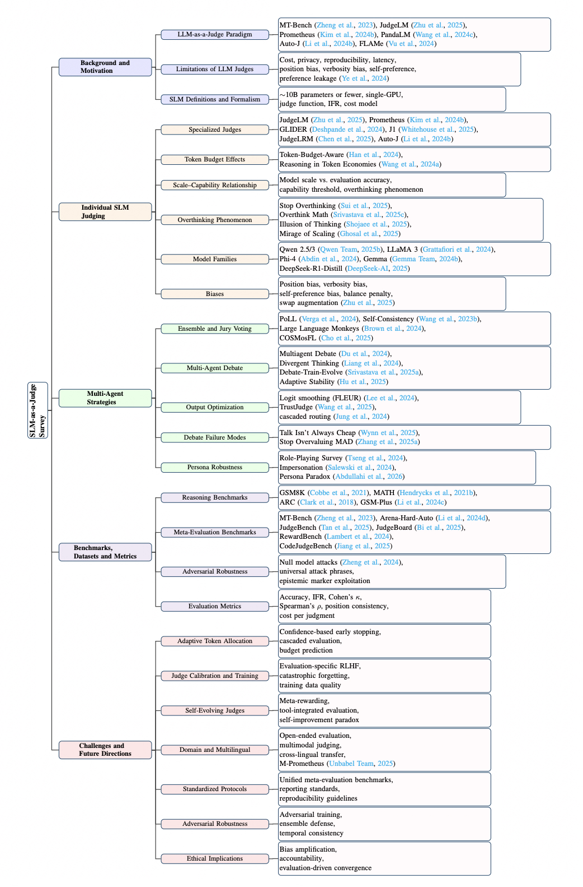

<p align="center">
  <h1 align="center">📐 Small Language Models as Judges: A Survey</h1>
</p>

<p align="center">
  <a href="#citation"></a>
  <a href="https://github.com/anishh15/SLM-as-a-Judge-Survey"></a>
  <a href="#citation"></a>
  
  
</p>

<p align="center">
  <em>A curated collection of papers, benchmarks, datasets, and resources for the <strong>SLM-as-a-Judge</strong> paradigm.</em>
</p>

---

## 🌟 About This Repository

This repository accompanies our survey paper **"Small Language Models as Judges: A Survey"**, which provides the first comprehensive review of the emerging paradigm where **Small Language Models (SLMs)**—operationally defined as models with **≤14B parameters** that can run on a single consumer GPU—serve as automated evaluators.

We organize the rapidly expanding literature around a structured taxonomy spanning five key dimensions:

1. **Background & Motivation** — Why SLM judges, formal definitions, and evaluation formalism
2. **Individual SLM Judging** — Specialized judges, token budgets, capability thresholds, overthinking, biases, and thinking modes
3. **Multi-Agent Strategies** — Ensembles, debate, output optimization, and persona robustness
4. **Benchmarks & Metrics** — Meta-evaluation infrastructure, adversarial robustness
5. **Challenges & Future Directions** — Eight open research problems

We will continuously update this repository with the latest papers and resources. If you find this helpful, please ⭐ star the repo!

> 📬 **Missing a paper?** Feel free to [open an issue](https://github.com/anishh15/SLM-as-a-Judge-Survey/issues) or submit a pull request.

---

## 📰 Updates

- 🔥 **[2025/XX]** — Paper submitted to arXiv; repository launched.

---

## 🌳 Table of Contents

- [About This Repository](#-about-this-repository)
- [Updates](#-updates)
- [Overview](#-overview)
- [Paper List](#-paper-list)
  - [1. Foundational LLM-as-a-Judge Work](#1-foundational-llm-as-a-judge-work)
  - [2. SLM-as-a-Judge Surveys & Definitions](#2-slm-as-a-judge-surveys--definitions)
  - [3. Specialized & Fine-Tuned Judge Models](#3-specialized--fine-tuned-judge-models)
  - [4. Token Budget, Reasoning Efficiency & Overthinking](#4-token-budget-reasoning-efficiency--overthinking)
  - [5. Ensemble & Panel-Based Methods](#5-ensemble--panel-based-methods)
  - [6. Multi-Agent Debate & Deliberation](#6-multi-agent-debate--deliberation)
  - [7. Persona Effects & Prompt Sensitivity](#7-persona-effects--prompt-sensitivity)
  - [8. Output Optimization & Post-Processing](#8-output-optimization--post-processing)
  - [9. Judge Biases & Preference Leakage](#9-judge-biases--preference-leakage)
  - [10. Adversarial Robustness](#10-adversarial-robustness)
  - [11. Multilingual Evaluation](#11-multilingual-evaluation)
  - [12. Self-Evolving & Self-Improving Judges](#12-self-evolving--self-improving-judges)
  - [13. Alignment, RLHF & Training Methods](#13-alignment-rlhf--training-methods)
  - [14. Reasoning & Chain-of-Thought](#14-reasoning--chain-of-thought)
  - [15. Model Papers](#15-model-papers)
- [Benchmarks & Datasets](#-benchmarks--datasets)
- [Related Surveys](#-related-surveys)
- [Citation](#-citation)
- [Contributing](#-contributing)

---

## 📊 Overview

<p align="center">
  
</p>

> *Figure: Taxonomy of the SLM-as-a-Judge survey, organized around five key dimensions: background and motivation, individual SLM judging, multi-agent strategies, benchmarks and metrics, and challenges and future directions.*

---

## 📑 Paper List

### 1. Foundational LLM-as-a-Judge Work

| Paper | Venue | Year | Links |
|-------|-------|------|-------|
| Judging LLM-as-a-Judge with MT-Bench and Chatbot Arena | NeurIPS | 2023 | [[pdf]](https://arxiv.org/abs/2306.05685) |
| JudgeLM: Fine-tuned Large Language Models are Scalable Judges | ICLR | 2025 | [[pdf]](https://arxiv.org/abs/2310.17631) [[code]](https://github.com/baaivision/JudgeLM) |
| Prometheus: Inducing Fine-grained Evaluation Capability in Language Models | ICLR | 2024 | [[pdf]](https://arxiv.org/abs/2310.08491) [[code]](https://github.com/prometheus-eval/prometheus) |
| Prometheus 2: An Open Source Language Model Specialized in Evaluating Other Language Models | ArXiv | 2024 | [[pdf]](https://arxiv.org/abs/2405.01535) |
| PandaLM: An Automatic Evaluation Benchmark for LLM Instruction Tuning | ICLR | 2024 | [[pdf]](https://arxiv.org/abs/2306.05087) [[code]](https://github.com/WeOpenML/PandaLM) |
| Auto-J: Generative Judge for Evaluating Alignment | ICLR | 2024 | [[pdf]](https://arxiv.org/abs/2310.05470) [[code]](https://github.com/GAIR-NLP/auto-j) |
| Humans or LLMs as the Judge? A Study on Judgement Biases | ArXiv | 2024 | [[pdf]](https://arxiv.org/abs/2402.10669) |
| Limitations of the LLM-as-a-Judge Approach for Evaluating LLM Outputs in Expert Knowledge Tasks | IUI | 2025 | [[pdf]](https://arxiv.org/abs/2410.20266) |
| Who Validates the Validators? Aligning LLM-Assisted Evaluation with Human Preferences | ArXiv | 2024 | [[pdf]](https://arxiv.org/abs/2404.12272) |

### 2. SLM-as-a-Judge Surveys & Definitions

| Paper | Venue | Year | Links |
|-------|-------|------|-------|
| Small Language Models: Survey, Measurements, and Insights | ArXiv | 2024 | [[pdf]](https://arxiv.org/abs/2409.15790) |
| ThinkSLM: The First Extensive Benchmark for Studying Small Language Model Reasoning | ArXiv | 2025 | *Link to be added* |
| BeyondBench: Contamination-Resistant Evaluation of Reasoning in Language Models | ArXiv | 2025 | [[pdf]](https://arxiv.org/abs/2509.24210) |
| EffGen: An Open-Source Agentic Framework Optimized for Small Language Models | ArXiv | 2025 | *Link to be added* |

### 3. Specialized & Fine-Tuned Judge Models

| Paper | Venue | Year | Links |
|-------|-------|------|-------|
| GLIDER: Grading LLM Interactions and Decisions using Explainable Ranking | ArXiv | 2024 | [[pdf]](https://arxiv.org/abs/2412.14140) [[model]](https://huggingface.co/PatronusAI/glider) |
| J1: Incentivizing Thinking in LLM-as-a-Judge via Reinforcement Learning | ArXiv | 2025 | [[pdf]](https://arxiv.org/abs/2505.10320) |
| JudgeLRM: Large Reasoning Models as a Judge | ArXiv | 2025 | [[pdf]](https://arxiv.org/abs/2504.00050) [[code]](https://github.com/NuoJohnChen/JudgeLRM) |
| CompassJudger-2: Towards Generalist Judge Model via Verifiable Rewards | ArXiv | 2025 | [[pdf]](https://arxiv.org/abs/2507.09104) |
| J4R: Learning to Judge with Equivalent Initial State Group Relative Policy Optimization | ArXiv | 2025 | [[pdf]](https://arxiv.org/abs/2505.13346) |
| Skywork-Critic: An Open-Source Critic Model for LLM Preference Evaluation | — | 2024 | [[model]](https://huggingface.co/Skywork/Skywork-Critic-Llama-3.1-8B) |
| Skywork-Reward: Bag of Tricks for Reward Modeling in LLMs | ArXiv | 2024 | [[pdf]](https://arxiv.org/abs/2410.18451) |
| FLAMe: Foundational Large Autorater Models | ArXiv | 2024 | [[pdf]](https://arxiv.org/abs/2407.10817) |
| TIGERScore: Towards Building Explainable Metric for All Text Generation Tasks | TACL | 2024 | [[pdf]](https://arxiv.org/abs/2310.00752) |
| Themis: A Reference-free NLG Evaluation Language Model | ArXiv | 2024 | [[pdf]](https://arxiv.org/abs/2406.18365) |
| Rethinking LLM-as-a-Judge: Representation-as-a-Judge with SLMs via Semantic Capacity Asymmetry | ArXiv | 2026 | [[pdf]](https://arxiv.org/abs/2601.22588) |
| Explicit Reasoning Makes Better Judges: A Systematic Study on Accuracy, Efficiency, and Robustness | ArXiv | 2025 | [[pdf]](https://arxiv.org/abs/2509.13332) |
| SelFee: Iterative Self-Revising LLM Empowered by Self-Feedback Generation | ArXiv | 2023 | [[pdf]](https://arxiv.org/abs/2305.01919) |
| Shepherd: A Critic for Language Model Generation | ArXiv | 2023 | [[pdf]](https://arxiv.org/abs/2308.04592) |

### 4. Token Budget, Reasoning Efficiency & Overthinking

| Paper | Venue | Year | Links |
|-------|-------|------|-------|
| Token-Budget-Aware LLM Reasoning | ACL Findings | 2025 | [[pdf]](https://arxiv.org/abs/2412.18547) |
| Reasoning in Token Economies: Budget-Aware Evaluation of LLM Reasoning Strategies | EMNLP | 2024 | [[pdf]](https://arxiv.org/abs/2406.06461) |
| Stop Overthinking: A Survey on Efficient Reasoning for Large Language Models | TMLR | 2025 | [[pdf]](https://arxiv.org/abs/2503.16419) |
| Do LLMs Overthink Basic Math Reasoning? Benchmarking Accuracy-Efficiency Tradeoff | ArXiv | 2025 | [[pdf]](https://arxiv.org/abs/2507.04023) |
| Reasoning Models Can Be Effective Without Thinking | ArXiv | 2025 | [[pdf]](https://arxiv.org/abs/2504.09858) |
| The Illusion of Thinking: Understanding Strengths and Limitations of Reasoning Models | NeurIPS | 2025 | [[pdf]](https://arxiv.org/abs/2506.06941) |
| Does Thinking More Always Help? Mirage of Test-Time Scaling in Reasoning Models | NeurIPS | 2025 | [[pdf]](https://arxiv.org/abs/2506.04210) |
| OptimalThinkingBench: Evaluating Over and Underthinking in LLMs | ArXiv | 2025 | [[pdf]](https://arxiv.org/abs/2508.13141) |

### 5. Ensemble & Panel-Based Methods

| Paper | Venue | Year | Links |
|-------|-------|------|-------|
| Replacing Judges with Juries: Evaluating LLM Generations with a Panel of Diverse Models (PoLL) | ArXiv | 2024 | [[pdf]](https://arxiv.org/abs/2404.18796) |
| Self-Consistency Improves Chain of Thought Reasoning in Language Models | ICLR | 2023 | [[pdf]](https://arxiv.org/abs/2203.11171) |
| Large Language Monkeys: Scaling Inference Compute with Repeated Sampling | ArXiv | 2024 | [[pdf]](https://arxiv.org/abs/2407.21787) |
| COSMosFL: Ensemble of Small Language Models for Fault Localisation | LLM4Code | 2025 | [[pdf]](https://arxiv.org/abs/2502.02908) |
| Crowd-based Comparative Evaluation: An Efficient Framework for LLM-as-a-Judge | ArXiv | 2025 | [[pdf]](https://arxiv.org/abs/2502.09556) |
| TrustJudge: Towards Trustworthy LLM-as-a-Judge | ArXiv | 2025 | [[pdf]](https://arxiv.org/abs/2501.10834) |

### 6. Multi-Agent Debate & Deliberation

| Paper | Venue | Year | Links |
|-------|-------|------|-------|
| Improving Factuality and Reasoning in Language Models through Multiagent Debate | ICML | 2024 | [[pdf]](https://arxiv.org/abs/2305.14325) |
| Encouraging Divergent Thinking in Large Language Models through Multi-Agent Debate | ACL | 2024 | [[pdf]](https://arxiv.org/abs/2305.19118) |
| DEBATE, TRAIN, EVOLVE: Self-Evolution of Language Model Reasoning | EMNLP | 2025 | [[pdf]](https://arxiv.org/abs/2505.15734) |
| Multi-Agent Debate for LLM Judges with Adaptive Stability Detection | ArXiv | 2025 | [[pdf]](https://arxiv.org/abs/2510.12697) |
| Efficient LLM Safety Evaluation through Multi-Agent Debate | ArXiv | 2025 | [[pdf]](https://arxiv.org/abs/2511.06396) |
| "Talk Isn't Always Cheap": Understanding Failure Modes in Multi-Agent Debate | ArXiv | 2025 | [[pdf]](https://arxiv.org/abs/2509.03495) |
| Stop Overvaluing Multi-Agent Debate: We Must Rethink Evaluation and Embrace Model Heterogeneity | ArXiv | 2025 | [[pdf]](https://arxiv.org/abs/2502.08788) |

### 7. Persona Effects & Prompt Sensitivity

| Paper | Venue | Year | Links |
|-------|-------|------|-------|
| Two Tales of Persona in LLMs: A Survey of Role-Playing and Personalization | EMNLP Findings | 2024 | [[pdf]](https://arxiv.org/abs/2406.01171) |
| In-Context Impersonation Reveals Large Language Models' Strengths and Biases | NeurIPS | 2024 | [[pdf]](https://arxiv.org/abs/2305.14930) |
| The Persona Paradox: Medical Personas as Behavioral Priors in Clinical Language Models | ArXiv | 2026 | [[pdf]](https://arxiv.org/abs/2601.05376) |
| SynthesizeMe! Inducing Persona-Guided Prompts for Personalized Reward Models | ACL | 2025 | [[pdf]](https://arxiv.org/abs/2506.05598) |

### 8. Output Optimization & Post-Processing

| Paper | Venue | Year | Links |
|-------|-------|------|-------|
| Trust or Escalate: LLM Judges with Provable Guarantees for Human Agreement | ICLR | 2025 | [[pdf]](https://arxiv.org/abs/2407.18370) |
| Generation Meets Verification: Accelerating LLM Inference with Smart Parallel Auto-Correct Decoding | ArXiv | 2024 | [[pdf]](https://arxiv.org/abs/2402.11809) |

### 9. Judge Biases & Preference Leakage

| Paper | Venue | Year | Links |
|-------|-------|------|-------|
| Preference Leakage: A Contamination Problem in LLM-as-a-Judge | ArXiv | 2024 | [[pdf]](https://arxiv.org/abs/2412.19498) |

### 10. Adversarial Robustness

| Paper | Venue | Year | Links |
|-------|-------|------|-------|
| Cheating Automatic LLM Benchmarks: Null Models Achieve High Win Rates | ICLR (Oral) | 2025 | [[pdf]](https://arxiv.org/abs/2410.07137) [[code]](https://github.com/sail-sg/Cheating-LLM-Benchmarks) |

### 11. Multilingual Evaluation

| Paper | Venue | Year | Links |
|-------|-------|------|-------|
| M-Prometheus: A Suite of Open Multilingual LLM Judges | COLM | 2025 | [[pdf]](https://arxiv.org/abs/2504.04953) |

### 12. Self-Evolving & Self-Improving Judges

| Paper | Venue | Year | Links |
|-------|-------|------|-------|
| Self-Taught Evaluators | ArXiv | 2024 | [[pdf]](https://arxiv.org/abs/2408.02666) |
| DEBATE, TRAIN, EVOLVE: Self-Evolution of Language Model Reasoning | EMNLP | 2025 | [[pdf]](https://arxiv.org/abs/2505.15734) |
| Weak-to-Strong Generalization: Eliciting Strong Capabilities With Weak Supervision | ArXiv | 2024 | [[pdf]](https://arxiv.org/abs/2312.09390) |
| TrueTeacher: Learning Factual Consistency Evaluation with Large Language Models | ArXiv | 2023 | [[pdf]](https://arxiv.org/abs/2305.11171) |

### 13. Alignment, RLHF & Training Methods

| Paper | Venue | Year | Links |
|-------|-------|------|-------|
| Training Language Models to Follow Instructions with Human Feedback | NeurIPS | 2022 | [[pdf]](https://arxiv.org/abs/2203.02155) |
| Constitutional AI: Harmlessness from AI Feedback | ArXiv | 2022 | [[pdf]](https://arxiv.org/abs/2212.08073) |
| Direct Preference Optimization: Your Language Model is Secretly a Reward Model | NeurIPS | 2023 | [[pdf]](https://arxiv.org/abs/2305.18290) |
| Let's Verify Step by Step | ICLR | 2024 | [[pdf]](https://arxiv.org/abs/2305.20050) |

### 14. Reasoning & Chain-of-Thought

| Paper | Venue | Year | Links |
|-------|-------|------|-------|
| Chain-of-Thought Prompting Elicits Reasoning in Large Language Models | NeurIPS | 2022 | [[pdf]](https://arxiv.org/abs/2201.11903) |
| Large Language Models are Zero-Shot Reasoners | NeurIPS | 2022 | [[pdf]](https://arxiv.org/abs/2205.11916) |
| DeepSeek-R1: Incentivizing Reasoning Capability via Reinforcement Learning | ArXiv | 2025 | [[pdf]](https://arxiv.org/abs/2501.12948) [[code]](https://github.com/deepseek-ai/DeepSeek-R1) |
| Learning to Reason with LLMs | OpenAI Blog | 2024 | [[link]](https://openai.com/index/learning-to-reason-with-llms/) |

### 15. Model Papers

| Paper | Venue | Year | Links |
|-------|-------|------|-------|
| GPT-4 Technical Report | ArXiv | 2023 | [[pdf]](https://arxiv.org/abs/2303.08774) |
| Qwen2.5 Technical Report | ArXiv | 2025 | [[pdf]](https://arxiv.org/abs/2412.15115) |
| Qwen3 Technical Report | ArXiv | 2025 | [[pdf]](https://arxiv.org/abs/2505.09388) |
| The Llama 3 Herd of Models | ArXiv | 2024 | [[pdf]](https://arxiv.org/abs/2407.21783) |
| Phi-4 Technical Report | ArXiv | 2024 | [[pdf]](https://arxiv.org/abs/2412.08905) |
| Phi-4-Mini Technical Report | ArXiv | 2025 | [[pdf]](https://arxiv.org/abs/2503.01743) |
| Phi-4-Reasoning Technical Report | ArXiv | 2025 | [[pdf]](https://arxiv.org/abs/2504.21318) |
| Gemma: Open Models Based on Gemini Research and Technology | ArXiv | 2024 | [[pdf]](https://arxiv.org/abs/2403.08295) |
| Gemma 2: Improving Open Language Models at a Practical Size | ArXiv | 2024 | [[pdf]](https://arxiv.org/abs/2408.00118) |

---

## 📦 Benchmarks & Datasets

### Meta-Evaluation Benchmarks

| Benchmark | Description | Paper |
|-----------|-------------|-------|
| **MT-Bench** | 80 multi-turn questions, 8 categories, pairwise + single-scoring | [Zheng et al., 2023](https://arxiv.org/abs/2306.05685) |
| **Arena-Hard-Auto** | 500 difficult open-ended prompts, 89.1% confidence agreement with Chatbot Arena | [Li et al., 2024](https://arxiv.org/abs/2406.11939) |
| **JudgeBench** | 350 challenging response pairs across knowledge, reasoning, math, coding | [Tan et al., 2025](https://arxiv.org/abs/2410.12784) |
| **RewardBench** | Evaluation of reward models across chat, safety, reasoning | [Lambert et al., 2024](https://arxiv.org/abs/2403.13787) |
| **JudgeBoard** | Benchmarking small language models for reasoning evaluation | [Bi et al., 2025](https://arxiv.org/abs/2511.15958) |
| **CodeJudgeBench** | Benchmarking LLM-as-a-Judge for coding tasks | [Jiang et al., 2025](https://arxiv.org/abs/2507.10535) |
| **ContextualJudgeBench** | Evaluating judges in contextual settings | [Xu et al., 2025](https://arxiv.org/abs/2503.15620) |

### Reasoning & Math Benchmarks (Used as Evaluation Substrates)

| Benchmark | Description | Paper |
|-----------|-------------|-------|
| **GSM8K** | 8.5K grade-school math word problems | [Cobbe et al., 2021](https://arxiv.org/abs/2110.14168) |
| **MATH** | 12.5K competition-level math problems across 7 topics | [Hendrycks et al., 2021](https://arxiv.org/abs/2103.03874) |
| **ARC** | 7.7K multiple-choice science questions for the AI2 Reasoning Challenge | [Clark et al., 2018](https://arxiv.org/abs/1803.05457) |
| **GSM-Plus** | Robustness evaluation of LLMs as mathematical problem solvers | [Li et al., 2024](https://arxiv.org/abs/2402.19255) |
| **MMLU** | Massive Multitask Language Understanding benchmark | [Hendrycks et al., 2021](https://arxiv.org/abs/2009.03300) |

---

## 📚 Related Surveys

| Survey | Focus | Year | Links |
|--------|-------|------|-------|
| A Survey on LLM-as-a-Judge | Formal definitions, reliability, bias in LLM-based evaluation | 2024 | [[pdf]](https://arxiv.org/abs/2411.15594) |
| From Generation to Judgment: Opportunities and Challenges of LLM-as-a-Judge | Transition from generation to judgment | 2024 | [[pdf]](https://arxiv.org/abs/2411.16594) |
| LLMs-as-Judges: A Comprehensive Survey on LLM-based Evaluation Methods | Comprehensive review of LLM evaluation methods | 2024 | [[pdf]](https://arxiv.org/abs/2412.05579) [[repo]](https://github.com/CSHaitao/Awesome-LLMs-as-Judges) |
| Efficient Large Language Models: A Survey | Efficiency techniques for large models | 2024 | [[pdf]](https://arxiv.org/abs/2312.03863) [[repo]](https://github.com/AIoT-MLSys-Lab/Efficient-LLMs-Survey) |
| Small Language Models: Survey, Measurements, and Insights | SLM architectures and deployment | 2024 | [[pdf]](https://arxiv.org/abs/2409.15790) |
| Stop Overthinking: A Survey on Efficient Reasoning for LLMs | Efficient reasoning and overthinking phenomenon | 2025 | [[pdf]](https://arxiv.org/abs/2503.16419) |

---

## 📖 Citation

If you find this survey and repository useful for your research, please cite our paper:

```bibtex
@article{laddha2025slmasjudgesurvey,
  title={Small Language Models as Judges: A Survey},
  author={Laddha, Anish and Pradhan, Nitesh and Srivastava, Gaurav},
  journal={ArXiv},
  year={2025}
}
```

---

## 🤝 Contributing

We welcome contributions from the community! If you'd like to add a paper, fix a link, or suggest improvements:

1. **Open an Issue**: Describe the paper or resource you'd like to add.
2. **Submit a Pull Request**: Use the following format for new paper entries:

```markdown
| Paper Title | Venue | Year | [[pdf]](link) [[code]](link) |
```

Please make sure to include:
- ✅ Correct arXiv or venue link
- ✅ Code/model links if available
- ✅ Correct categorization within our taxonomy

---

## 📄 License

This project is licensed under the [MIT License](LICENSE).

---

<p align="center">
  <em>If you find this repository helpful, please consider giving it a ⭐!</em>
</p>
